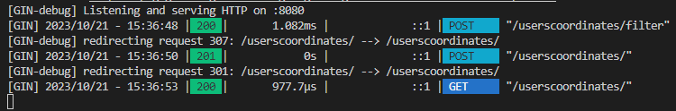

# Users Coordinates System

## Table of Contents
- [User Stories](#user-stories)
- [Design](#design)
- [Models](#models)
- [Endpoints](#endpoints)
- [Config](#config)
- [Test cases](#tests)
- [Logs](#logs)
- [Execution](#execution)
- [Postman tests](#postman-tests)

## User Stories

### User Story: Filter Users Coordinates

As a user of the Users Coordinates system,
I want to filter a list of user coordinates based on a maximum distance from a reference point,
So that I can identify and view the user coordinates that are within the specified range.

Acceptance Criteria:

Given I have a list of user coordinates and a reference point,
when I provide a maximum distance value,
Then the system should filter and display the user coordinates that are within the specified maximum distance from the reference point.

### User Story: Create User Coordinates

As a user of the Users Coordinates system,
I want to add new user coordinates with specific details,
So that I can record the geographical positions of users in the system.

Acceptance Criteria:

Given I have user coordinate details to input,
When I provide the user's ID, name, latitude, and longitude,
Then the system should successfully create and store the user coordinates with the provided information.

### User Story: Get All Users Coordinates

As a user of the Users Coordinates system,
I want to retrieve a list of all user coordinates stored in the system,
So that I can view and access the geographical positions of all users in one place.

Acceptance Criteria:

Given I want to view all user coordinates,
When I request to retrieve all user coordinates,
Then the system should provide me with a list of user coordinates, including their IDs, names, latitudes, and longitudes.

## Design

The design of the Users Coordinates API was meticulously crafted using OpenAPI, a widely recognized and standardized specification for describing RESTful web services. 

You can access the OpenAPI design document here
<a href="design/users-coordinates.yaml" target="_blank">users-coordinates.yaml</a>

OpenAPI allowed us to define the API's structure, endpoints, request/response formats, and data models with utmost precision and clarity. 

This design serves as a comprehensive blueprint for the API's behavior, enabling developers and stakeholders to have a clear understanding of its capabilities. 

By employing OpenAPI, we ensure consistency, interoperability, and ease of integration, making it an essential tool in our development process.

## Models

**UserCoordinates**

| Field      | Type    | Description                        |
|------------|---------|------------------------------------|
| `Id`         | Integer | The ID of the user coordinates     |
| `Name`       | String  | The name of the user               |
| `Latitude`   | Double  | The latitude of the user coordinates |
| `Longitude`  | Double  | The longitude of the user coordinates |
| `Distance`   | Double  | The distance to the reference point |

The UserCoordinates struct represents the core data model used in the Users Coordinates system. This struct serves as a container for user-specific geographical information. It includes the following fields:

## Endpoints

### Filter User Coordinates
- **Description:** As a user, I want to filter a file of user coordinates based on a maximum distance from a reference point.
- **Endpoint:** `/userscoordinates/filter`
- **Request Method:** POST
- **Request Body:**
  - `file` (File): The file containing user coordinates data (multipart/form-data)
  - `maxdistance` (Number): The maximum distance for filtering coordinates
- **Response Format:**
  - JSON with fields: `status`, `count`, and `items`

### Create User Coordinates
- **Description:** As a user, I want to create user coordinates.
- **Endpoint:** `/userscoordinates`
- **Request Method:** POST
- **Request Body:**
  - `Id` (Integer): The ID of the user coordinates
  - `Name` (String): The name of the user
  - `Latitude` (Double): The latitude of the user coordinates
  - `Longitude` (Double): The longitude of the user coordinates
- **Response Format:**
  - JSON with fields: `status` and `item`

### Get All Users Coordinates
- **Description:** As a user, I want to retrieve all user coordinates.
- **Endpoint:** `/userscoordinates`
- **Request Method:** GET
- **Response Format:**
  - JSON with fields: `status`, `count`, and `items`

## Config

The project uses a configuration file located at `config/config.yaml` to define several variables, providing a flexible way to configure the application's behavior.

You can access the config file here
<a href="config/config.yaml" target="_blank">config.yaml</a>

This approach avoids hard-coding values in the source code, making it easier to customize the application to your specific needs.

| Configuration Variable         | Description                                                            | Default Value  |
|-------------------------------|------------------------------------------------------------------------|-----------------|
| `port`                        | The port on which the server runs.                                     | `8080`          |
| `maxDistance`                 | The maximum distance for filtering coordinates.                        | `100`           |
| `referencePointLatitude`      | The latitude of the reference point.                                   | `53.339428`     |
| `referencePointLongitude`     | The longitude of the reference point.                                  | `-6.257664`     |
| `earthRadius`                 | The Earth's radius in kilometers.                                     | `6371`          |
| `tolerance`                   | A tolerance value.                                                    | `0.01`          |

This table summarizes the configuration variables used in the project, along with their descriptions and default values.

The configuration is loaded in the main package using the config.LoadConfig function, and the loaded configuration object is passed as a parameter to the endpoints to control the behavior of the API.
 
 The configObject is declared as a package-level variable and used throughout the project to access these configuration settings.

## Test cases

The application includes a dedicated folder named "tests" where you can find all the test cases used to ensure the reliability and functionality of the API. 

You can access the test cases here
<a href="tests" target="_blank">tests</a>

These tests cover various aspects of the application, including configuration loading, coordinate calculations, file processing, and logging. The test cases help verify that the application behaves correctly and handles different scenarios as expected.

### Configuration Tests
- **TestLoadValidConfig:** This test loads a valid configuration file and compares the loaded configuration with an expected configuration. It ensures that the API can load a valid configuration file correctly.

- **TestLoadNonExistentConfigFile:** This test attempts to load a non-existent configuration file and checks for the expected error. It verifies that the API handles non-existent files appropriately.

- **TestLoadInvalidConfigFile:** This test creates a temporary invalid configuration file with incorrect data types and attempts to load it. It checks for the expected error and verifies that the API handles invalid configuration files.

### Coordinates Tests
- **TestDegreesToRadians:** This test validates the DegreesToRadians function, which converts degrees to radians. It checks several test cases to ensure that the conversion is accurate.

- **TestHaversineDistance:** This test calculates the Haversine distance between New York and Los Angeles using latitude and longitude coordinates. It checks the calculated distance against an expected value.

- **TestFilterCoordinatesByDistance:** This test filters a set of user coordinates based on a maximum distance from a reference point. It verifies the filtering logic and expected results.

### File Processing Tests
- **TestProcessUploadedFile:** This test creates a test file, writes test data to it, and processes the file to extract user coordinates. It checks if the extracted coordinates match the expected values.

### Logging Tests
- **TestLogError:** This test logs an error message to a temporary log directory. It verifies that the log file is created, handles log file creation errors, and handles log file write errors.

## Logs

The application maintains a dedicated "logs" folder, where it generates log files on a daily basis to record any errors encountered during execution. 

You can access the logs files here
<a href="logs" target="_blank">logs</a>

These log files are organized by date and provide a record of any errors or issues that may arise during the application's operation. This logging mechanism is vital for monitoring and diagnosing any unexpected behavior, helping maintain the reliability of the Users Coordinates API.

## Execution

To build, run, and manage this project, a Makefile is provided with various targets.

You can find the makefile here
<a href="makefile" target="_blank">makefile</a>

Please ensure that you are in the `users-coordinates-api` folder when executing these make commands. 

- **Clean the Project:**
  - Remove the compiled binary.
  - Usage: `make clean`

- **Install Project Dependencies:**
  - Download project dependencies using Go modules.
  - Usage: `make install`

- **Run Tests:**
  - Execute tests in the "tests" directory.
  - Usage: `make test`

- **Build and Run the Project:**
  - Detect the operating system (Windows or Linux) and build the project accordingly.
  - Usage: `make build` (followed by `make run`).

    **For Linux:**
    - Build: `make build`
    - Run: `make run`

    **For Windows:**
    - Build: `make build` (Windows executable)
    - Run: `make run`

- **Shortcut for All:**
  - A shortcut to clean, install dependencies, run tests, build, and run the project sequentially.
  - Usage: `make all`

Please use these make targets for managing the project, making it easier to build and execute on your specific operating system.

Your http server should be up and running, as shown in the image below

## Postman tests

### Filter User Coordinates

- **Step 1:** Create a new request with the configuration as shown below. "file" and "maxdisance" keys are mandatory.

- **Step 2:** Find the file with customers' coordinates.

- **Step 3:** Ensure that values are assigned to both the 'file' and 'maxdistance' keys.

- **Step 4:** Send the request. You should get a filtered list of users living not far from the max distance to the reference point.

### Create User Coordinates

- **Step 1:** Create a new request with the configuration as shown below. 

- **Step 2:** Send the request. You should receive a response with a random ID for the user coordinates.

### Get All Users Coordinates

- **Step 1:** Create a new request with the configuration as shown below. 

- **Step 2:** Send the request. You should receive a list with all the users' coordinates present in the <a href="data/customers.txt" target="_blank">data/customers.txt</a> file.

### Server activity

